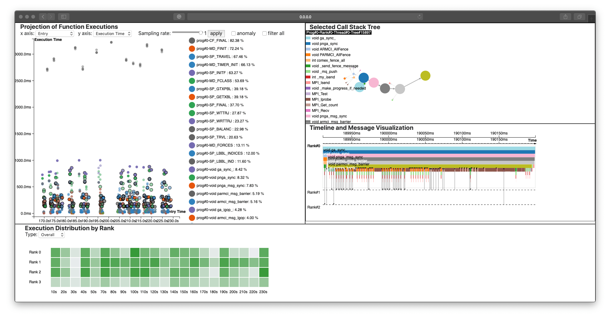
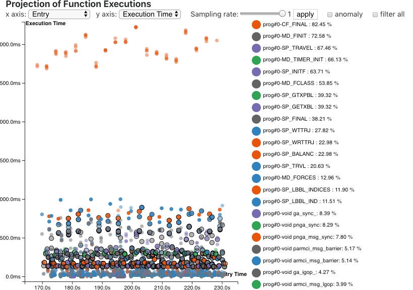
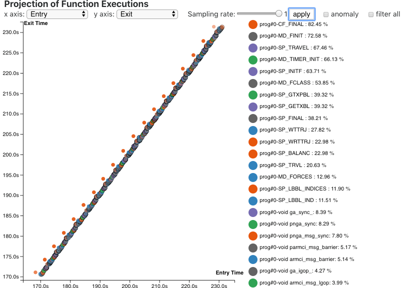

# Chimbuko Performance Visualization 

[](https://travis-ci.org/CODARcode/ChimbukoVisualization)

## Overview 



This is a visualization framework for online performance analysis. This framework mainly focuses on visualizing real-time anomalous behaviors in a High Performance Computing application so that any patterns of anomalies that users might not have recognized can be effectively detected through online visual analytics. 

This framework provides four major features:

* Streaming data reduction and aggregation
* Sliding time window of workflow overview for regular and anomaly function executions
* Selected function execution in a reduced call stack tree structure
* Selected function execution and message passing details in zoomable timelines
* Overall events distribution by rank

The following four visualization components are provided:

* Projection of Function Execution
* Selected Call Stack Tree
* Timeline and Message Visualization
* Execution Distribution by Rank 


## Software Dependency

This framework is a web application for which the back-end was built with `Python3.x` and `Flask` and the front-end was developed with `Javascript` and `D3.js`. 


## Installation

Please be advised that this framework is containerized as a single `docker` image so that there is no need to spend time on any issues with the software dependency.

### Using docker
The `docker` repository is currently private. The access information will be added soon.

### Manual install
In order to manually install this framework, make sure that `Python3.x` and `pip3` are installed on your machine.

If they are already installed, `Numpy` and `Flask` can be installed by:

```bash
$ pip3 install Numpy
$ pip3 install Flask
```

Now, please clone the repository of this project to run the visualization framework by: 

```bash
$ git clone [TBA]
```


## Execution

Before starting a visualization server, a port number can be modified if needed. Please open `main.py`:

```python
port = 5000 # replace 5000 with your preference
```

Start visualization server:

```bash
$ python3 main.py
```

If the visualization server runs, by default, `localhost:5000` will work.

## Sending Requests

### Rest APIs Supported

The visualization server accepts `POST` method requests to `localhost:5000/events` with data in the `json` header. Please send the following requests in the following order.

- Reset/initialize the server:

```javascript
{ 
    "type":"reset"
}
```

- Provide function names in order

```javascript
{ 
    "type":"functions", 
    "value": ["function", "names", "in", "string", "type"]
}
```

- Provide events types in order

```javascript
{ 
    "type":"event_types", 
    "value": ["event", "types", "in", "string", "type"]
}
```

- Provide trace information with the function of interest `foi` and anomaly functions `labels`:

```javascript
{ 
    "type":"info",
    "value":{
        "events": [],
        "foi": [], // a list of indices based on function names 
        "labels": [] // a list of lineid
    }
}
```

### Offline Simulation

Currently, `parserNWChem.py` can be used for an offline demo.

```bash
$ cd web
$ python3 parserNWChem.py
```


## Interface Description

### Projection of Function Executions
Trace events are visualized on a scatter plot in a streaming fashion. If some events were detected as an anomaly, they will be highlighted by making the size bigger than normal executions. 



More visual patterns can be recognized by adjusting the axis. For example: Rank vs. Execution time, Entry time vs. Exit time, etc.




The various filtering is also provided so that particular functions or only anomaly data can be easily observed.


### Selected Call Stack Tree 
For a particular function execution, clicking the specific data point on the scatter plot will show detailed call stack information.


### Timeline and Message Visualization
The detailed timeline and message communication of a specific function can also be visualized. Dragging the timeline will focus on a particular interval.


### Visualization for Events Distribtuion by Rank 
The overall distribution of executions can also be identified. Moreover, domain scientists can easily identify which processor was problematic at which moment by visualizaing the amount of anomalies per processor.


## Unit Test
We support the automated unit-test to make sure that the basic functionalities are correctly working as we expect. Please try the following commands to build an automated script first:

```console
$ cd [PATH/TO/ROOT/OF/PROJECT]
$ make 
```

After creating the script, the unit-test can be run by:

```console
$ make test
```

Report of the test cases will be printed:

```console
----------------------------------------------------------------------
Ran 4 tests in 14.663s

OK
```
